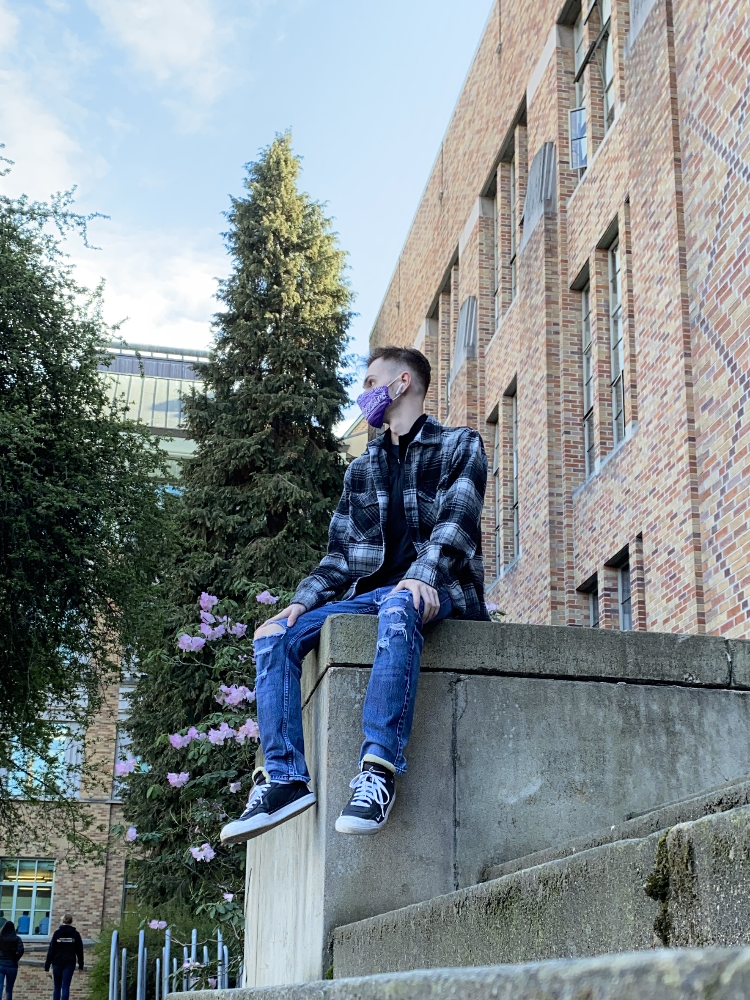

# Maxwell Jayne

maxjayne@uw.edu
(206)XXX-XXXX
Seattle, WA

# Skills Summary
 
<li>Fast-paced customer service experience
<li>Background with R, Python, & Javascript
<li>GIS experience
<li>Web development experience
<li>Accrual based and managerial accounting
<li>Detail oriented
<li>Focused and diligent 

# Education

[## University of Washington (Seattle, WA)] (http://www.washington.edu/)

**Bachelors in Geography - data science focus** *(in progress)*

*Attended:* 2018-2023
Class Focus

## [Seattle Central Community College (Seattle, WA)] (https://seattlecentral.edu/)

**Associate of Arts**

*Attended:* 2016-2018
Class Focus

# Work Experience

## Zara
**Sales/Stock Associate:** (Jan 2020-Sept 2021)
<li>Assisted in stockroom optimization with focuses on efficiency and organization.
<li>Contact: Arnold Nuique,

## Nike
**Seasonal Athlete (retail sales associate):** (Dec 2018-Jan 2019; Jun 2019-Sept 2019)
<li>Worked with a sales team in a fast-paced customer service environment.
<li>Primary focuses included aiding customers in their retail experience and maintaining store standards. 
<li>Contact: Jason Neckopulos, 925-348-6453

## Jet City IT
**Subcontractor:** (April 2017-June 2019)
<li>I work on a team that dismantles and reassembles computer set-ups and provides technical support.
<li>Contact: Simone Hrycenko, simone@jetcityit.com

## Seattle Public Utilities
**Engineering aide/trainee:** (June 2015-August 2015)
<li>Interned under the supervision of Jason Perkizas, a structural engineer at Seattle Public Utilities.
<li>Helped build a preliminary cost estimation program on Microsoft Excel for pipeline construction projects.
